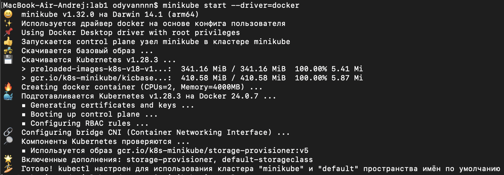
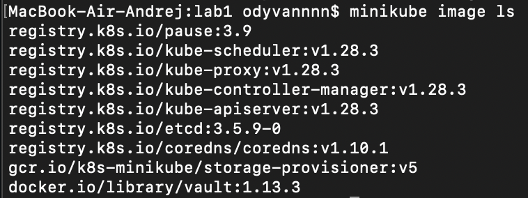
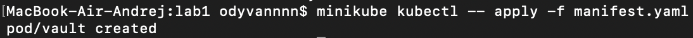
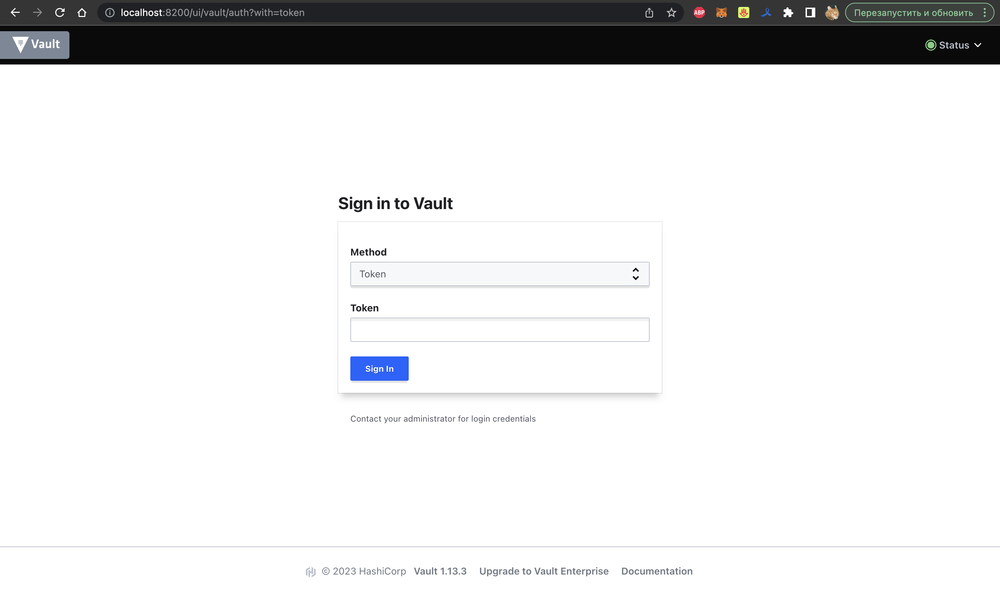
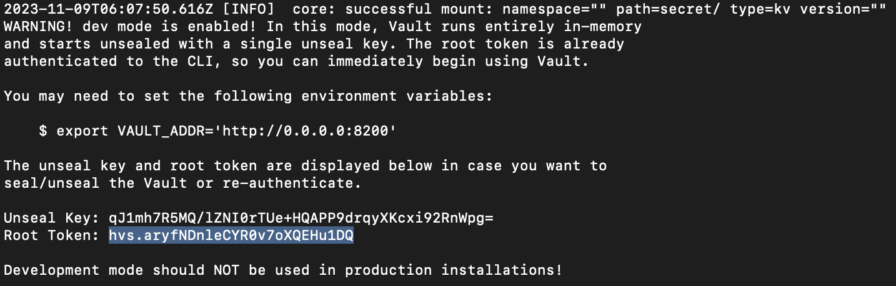
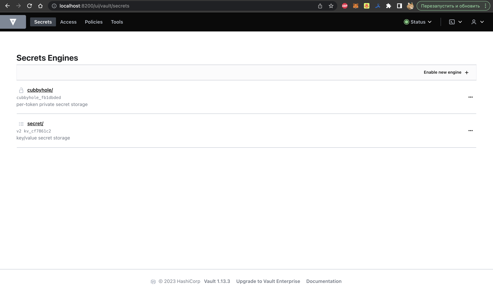
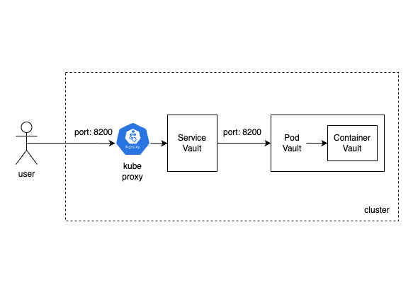

University: [ITMO University](https://itmo.ru/ru/)\
Faculty: [FICT](https://fict.itmo.ru)\
Course: [Introduction to distributed technologies](https://github.com/itmo-ict-faculty/introduction-to-distributed-technologies)\
Year: 2023/2024\
Group: K4113с\
Author: Polyakov Andrei Alekseevich\
Lab: Lab1\
Date of create: 09.11.2023\
Date of finished:

# Лабораторная работа №1 "Установка Docker и Minikube, мой первый манифест."

## Цель работы
Ознакомиться с инструментами Minikube и Docker, развернуть свой первый "под".

## Ход работы

### 1. Разворачивание minikube cluster
Для запуска minikube с Docker выполняется команда:
```bash
minikube start --driver=docker
```


Далее выполняется команда, которые добавляет на нашей локальной машине в список образов образ нужного ПО - Vault.
```bash
docker pull vault:1.13.3
```
Для проверки наличия образа можно воспользоваться следующей командой:
```bash
#просмотреть в minikube список всех образов
minikube image ls
```


### 2. Манифест для развертывания "пода" HashiCorp Vault
Манифест (manifest.yaml) прилагается в папке lab1.
Манифест составляется в соответствии с object model Kubernetes, которая содержит ряд обязательных полей:
- `apiVersion` - используемая версия API;
- `kind` - тип описываемого объекта;
- `metadata` - метаданные;
- `spec` - конфигурация объекта;

### 3. Создание пода Vault и получение доступа к контейнеру
Далее запускается под с помощью команды:
```bash
kubectl apply -f manifest.yaml
```


Далее необходимо создать сервис для доступа к этому контейнеру с помощью команды:
```bash
kubectl expose pod vault --type=NodePort --port=8200
```
После создания сервиса нужно попасть в контейнер. Для этого нужно воспользоваться командой `kubectl port-forward`:
```bash
kubectl port-forward service/vault 8200:8200
```
Данная команда перенаправляет трафик с клиентского устройства по указанному порту (`8200`) на указанный порт (`8200`) сервиса пода vault (`service/vault`).
Minikube прокинул порт компьютера в контейнер и теперь можно зайти в vault по ссылке http://localhost:8200


### 4. Найти сгенерированный корневой токен, чтобы получить доступ к Vault
Для поиска токена, необходимого для входа нужно использовать команду `kubectl logs`, который используется для получения логов из контейнера в указанном поде:
```bash
kubectl logs vault
```


Копируем Root Token и используем его для входа в vault:



### 5. Схема организации контейеров и сервисов 
Схема организации представлена на рисунке:
