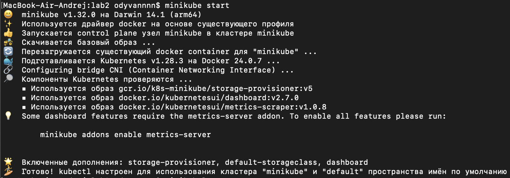
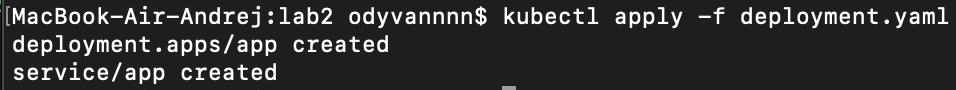
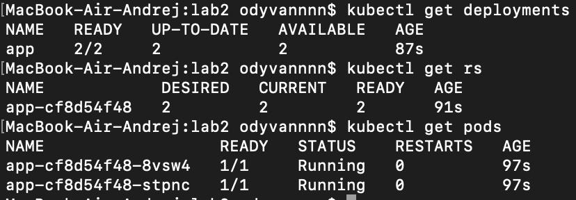
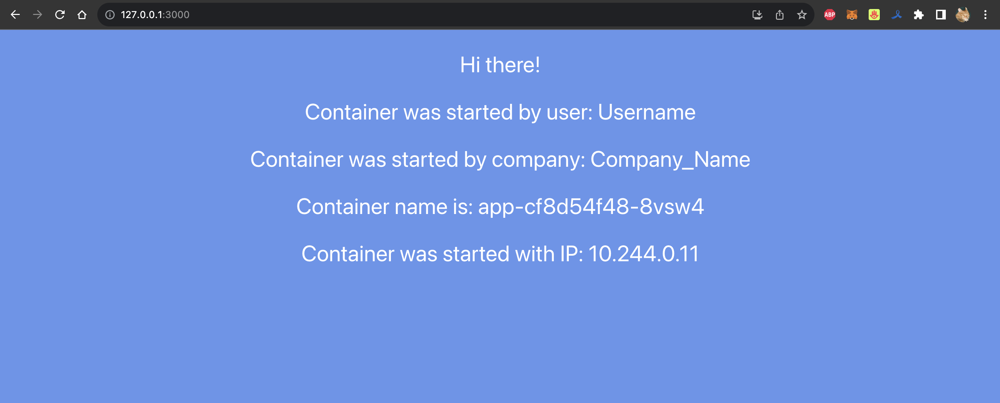
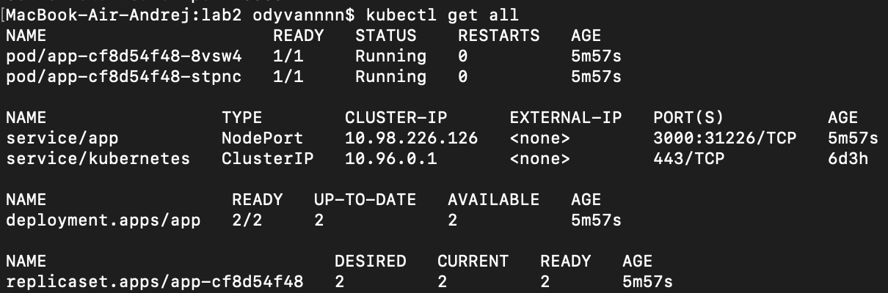
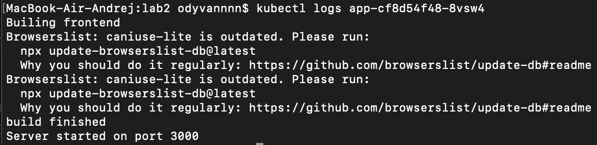
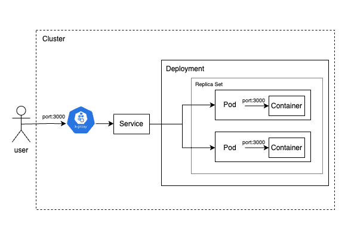

University: [ITMO University](https://itmo.ru/ru/)\
Faculty: [FICT](https://fict.itmo.ru)\
Course: [Introduction to distributed technologies](https://github.com/itmo-ict-faculty/introduction-to-distributed-technologies)\
Year: 2023/2024\
Group: K4113с\
Author: Polyakov Andrei Alekseevich\
Lab: Lab2\
Date of create: 15.11.2023\
Date of finished:

# Лабораторная работа №2 "Развертывание веб сервиса в Minikube, доступ к веб интерфейсу сервиса. Мониторинг сервиса."

## Цель работы
Ознакомиться с типами "контроллеров" развертывания контейнеров, ознакомится с сетевыми сервисами и развернуть свое веб приложение.

## Ход работы

### 1. Создание манифеста
Первым делом создается манифест `deployment`, в котором описывается конфигурация развертывания веб-сервиса.
Назначение полей в `spec`:
* `replicas` отвечает за количество реплик контейнеров, которые необходимо создать;
* `selector` указывает каким образом созданный `ReplicaSet` должен определить, каким из подов управлять. В данном случае используется селектор по label (`matchLabels`), который указывает, что `ReplicaSet` управляет подами у которых имеется label `app` со значением `app`;
* `template` описывает шаблон подов, которые необходимо создать;
* `env` позволяет выставить переменные окружения внутри контейнеров.

Манифест для создания `Deployment`:

```bash
apiVersion: apps/v1
kind: Deployment
metadata:
  name: app
  labels:
    app: app
spec:
  replicas: 2
  selector:
    matchLabels:
      app: app
  template:
    metadata:
      labels:
        app: app
    spec:
      containers:
      - name: itdt-contained-frontend
        image: ifilyaninitmo/itdt-contained-frontend:master
        ports:
        - containerPort: 3000
          name: http
        env:
          - name: REACT_APP_USERNAME
            value: 'Username'
          - name: REACT_APP_COMPANY_NAME
            value: 'Company_Name'
```

Также в этом yaml-файле можно прописать манифест для `service`, который будет запускаться одновременно с `deployment`:

```bash
apiVersion: v1
kind: Service
metadata:
  name: app
spec:
  type: NodePort
  ports:
    - port: 3000
      protocol: TCP
      name: http
  selector:
    app: app
```

### 2. Запуск Minikube
Для начала работы необходимо запустить Minikube



### 3. Создание `deployment`
Далее создаем `deployment` с помощью команды:

```bash
kubectl apply -f deployment.yaml
```



Для проверки, что все создалось, можно воспользоваться следющими командами:

```
kubectl get deployments
kubectl get rs
kubectl get pods
```



### 4. Подключение к контейнерам через веб-браузер
Для подключения к созданным контейнерам через веб браузер нужно перенаправить трафик с одного из портов клиентского устройства на порт сервиса с помощью следующей команды:

```
kubectl port-forward service/app 3000:3000
```

### 5. Проверка переменных `REACT_APP_USERNAME`, `REACT_APP_COMPANY_NAME` и `Container name` на странице в браузере

Для проверки работоспособности нужно перейти по ссылке [http://localhost:3000](http://localhost:3000):



При переходе по ссылке, запрос попадает на одну из двух реплик контейнеров, которые были созданы ранее. На странице содержится название контенера, на который попал запрос и его IP внутри кластера. Эти значения могут измениться, если запрос попадет на другой контейнер.
Значения переменнных `REACT_APP_USERNAME` и `REACT_APP_COMPANY_NAME` меняться не будут, поскольку они соответствуют переданным в коде значениям.

### 6. Проверка логов контейнеров

Для того, чтобы узнать названия контейнеров, можно воспользоваться командой, которая выведет информацию о содержимом кластера:

```
kubectl get all
```



Узнав названия обоих контейнеров - можно посмотреть логи каждого из них:




### 7. Схема организации контейеров и сервисов 
Схема организации представлена на рисунке:

