University: [ITMO University](https://itmo.ru/ru/)\
Faculty: [FICT](https://fict.itmo.ru)\
Course: [Introduction to distributed technologies](https://github.com/itmo-ict-faculty/introduction-to-distributed-technologies)\
Year: 2023/2024\
Group: K4113с\
Author: Polyakov Andrei Alekseevich\
Lab: Lab3\
Date of create: 27.11.2023\
Date of finished:

# Лабораторная работа №3 "Сертификаты и "секреты" в Minikube, безопасное хранение данных."

## Цель работы
Познакомиться с сертификатами и "секретами" в Minikube, правилами безопасного хранения данных в Minikube.

## Ход работы

### 1. Создание манифеста
В манифесте необходимо описать несколько сущностей:
* `ConfigMap`, через которую будут передаваться нужные переменные,
* `Deployment`, которая будет использоваться вместо ReplicaSet,
* `Service`, через которую будет осуществляться доступ к подам,
* `Ingress`, через которую будет обрабатываться внешние запросы к кластеру.

Манифест для создания `Deployment` будет состоять из нескольких частей:

`ConfigMap`:
```yaml
apiVersion: v1
kind: ConfigMap
metadata:
  name: lab3-app
data:
  REACT_APP_USERNAME: "Polyakov"
  REACT_APP_COMPANY_NAME: "ITMO"
```

`Deployment`:
```yaml
apiVersion: apps/v1
kind: Deployment
metadata:
  name: lab3-frontend
spec:
  replicas: 2
  selector:
    matchLabels:
      app: lab3-frontend
  template:
    metadata:
      labels:
        app: lab3-frontend
    spec:
      containers:
      - name: lab3-frontend
        image: ifilyaninitmo/itdt-contained-frontend:master
        envFrom:
          - configMapRef:
              name: lab3-app
        ports:
          - containerPort: 3000
```
В секции `envFrom` указывается имя `ConfigMap` из которого берутся переменные `REACT_APP_USERNAME` и `REACT_APP_COMPANY_NAME`. 

`Service`:
```yaml
apiVersion: v1
kind: Service
metadata:
  name: lab3-service
spec:
  selector:
    app: lab3-frontend
  ports:
    - port: 3000
      protocol: TCP
      name: http
  type: LoadBalancer
```

Сущность `Ingress` можно сделать в отдельном файле `ingress.yaml`:

`Ingress`:
```yaml
apiVersion: networking.k8s.io/v1
kind: Ingress
metadata:
  name: lab3-ingress
spec:
  tls:
    - hosts:
        - lab3frontend.com
      secretName: lab3-tls
  rules:
    - host: lab3frontend.com
      http:
        paths:
          - path: /
            pathType: Prefix
            backend:
              service:
                name: lab3-service
                port:
                  number: 3000
```
В поле ingress мы указываются следующие секции:
* В секции `tls` указываются, откуда получаются секреты (значение получается из отдельно созданного файла),
* В секции `rules` указываются правила обработки запросов:
  * `PathType: Prefix` и `path: /` задают условие, что под указанные правила попадают все пути, по которым можно обращаться к данному приложению.
  * Поле `backend` позволяет указать, на какой конкретно сервис надо направить запрос.

### 2. Запуск Minikube
Для начала работы необходимо запустить Minikube:

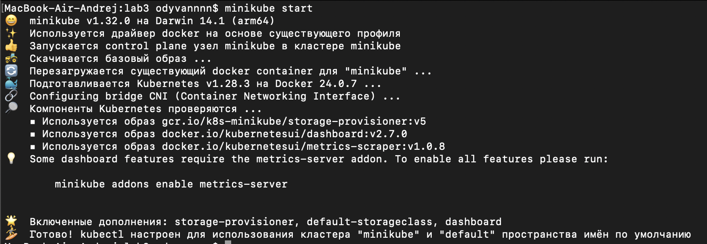

Далее нужно установить аддон `Ingress`

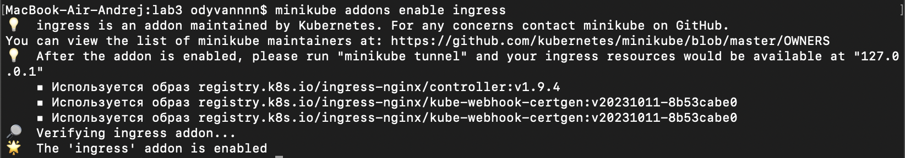

### 3. Создание `deployment`
Далее создается `deployment` с помощью команды:
```bash
kubectl apply -f deployment.yaml
```

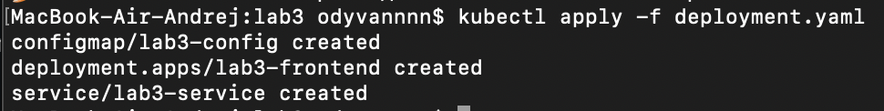

Для проверки, что все создалось, можно воспользоваться следющими командами:

```
kubectl get pod
kubectl get service
kubectl get deployment
kubectl get configmap
```

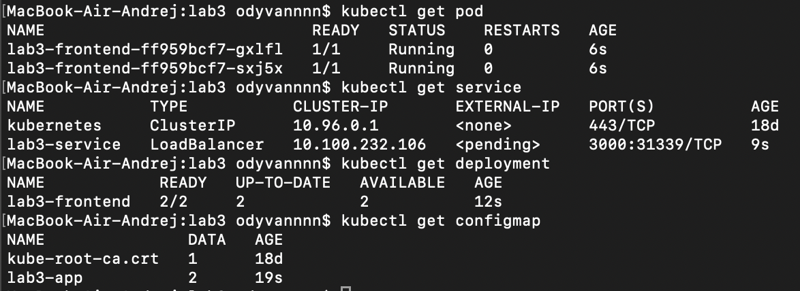

### 4. Создание сертификата
Затем необходимо создать сертификат и передать его в minikube. Это можно сделать средствами `openssl` с помощью команды:
```bash
$ openssl req -x509 -newkey rsa:4096 -sha256 -days 12 -nodes -keyout tls.key -out tls.crt -subj "/CN=lab3frontend.com"
```

Что делает эта команда?
* `-newkey rsa:4096` указывает, что у будет ключ длиной 4096 бит,
* `-x509` указывает, что создается сертификат по станларту X.509,
* `-sha256` сгенерирует сертификат с использованием `sha256` суммы,
* `-days 365` указывает, что срок валидности этого сертификата - 12 дней,
* `-nodes` позволит не зашифровывать приватный ключ парольной фразой,
* `-keyout tls.key` описывает, куда будет помещен полученный ключ,
* `-out tls.crt` описывает, куда будет помещен полученный сертификат,
* `/CN=lab3frontend.com` описывает имя хоста, для которого предназначен сертификат.

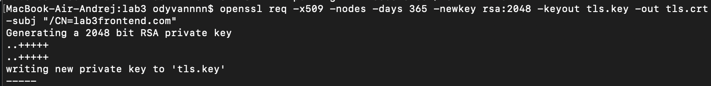

Далее добавляется сертификат в minikube:

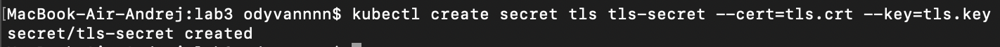

После этого нужно создать `Ingress` с помощью команды:
```bash
kubectl apply -f ingress.yaml
```

Проверка статуса:
```bash
kubectl get ingress
```

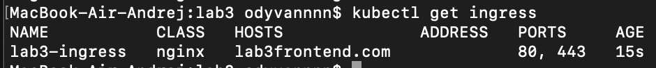

### 5. Подготовка кластера

Для продолжения работы необходимо добавить запись хоста в /etc/hosts: В работе использовалась утилита vim.
```bash
$ sudo vim /etc/hosts 
```

После добавления записи нужно сохранить файл и выйти из vim.

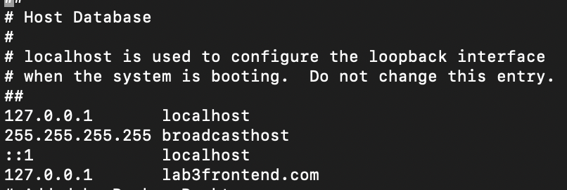

### 6. Проверка работы

Теперь нужно запустить `minikube tunnel`:

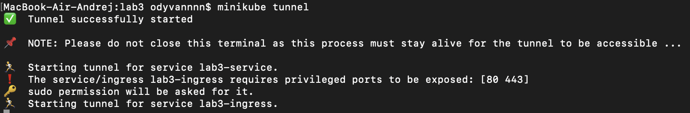

Далее нужно перейти по доменному имени `lab3frontend.com` в браузере:

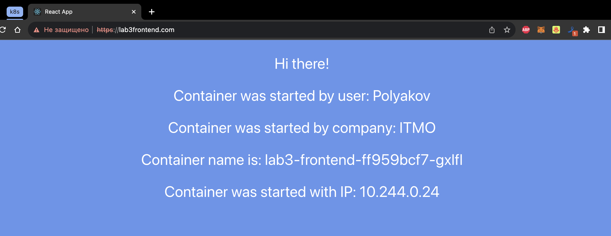

Проверка сертификата:

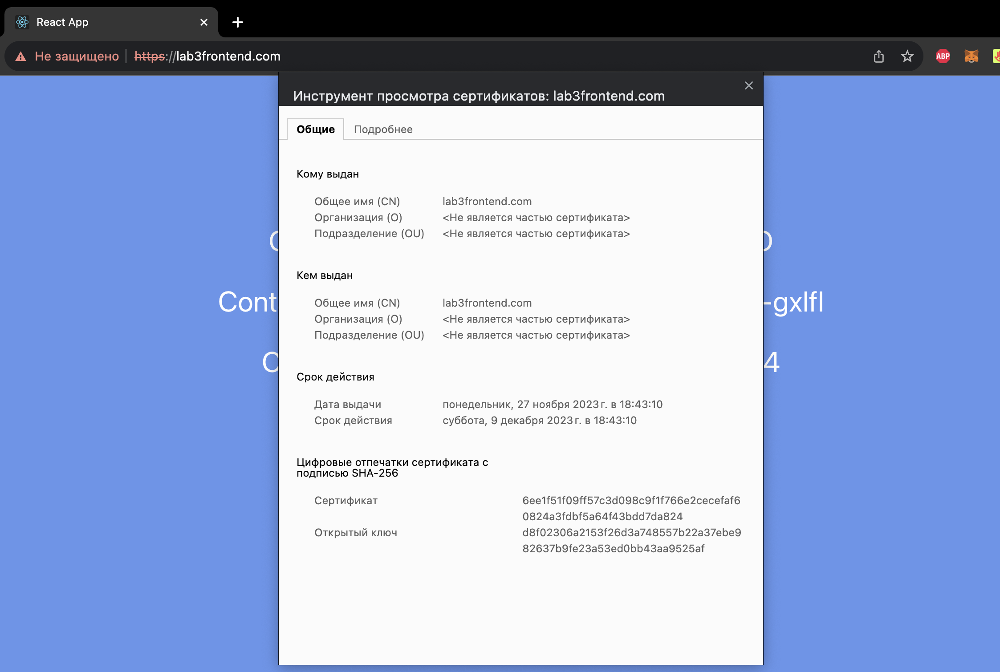

### 7. Схема организации контейеров и сервисов 
Схема организации представлена на рисунке:

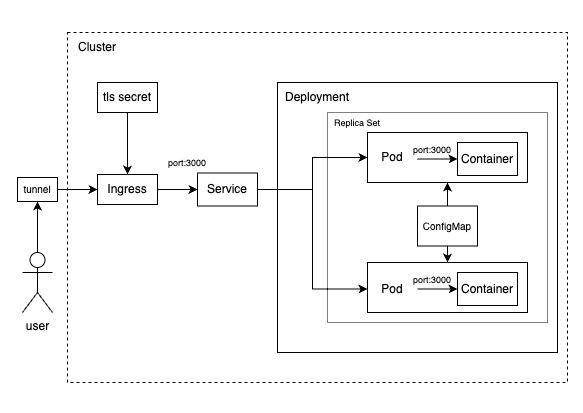