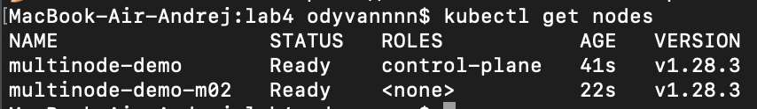
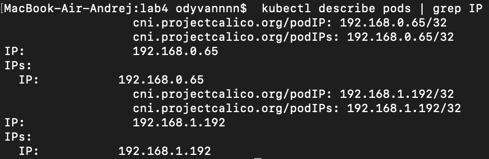

University: [ITMO University](https://itmo.ru/ru/)\
Faculty: [FICT](https://fict.itmo.ru)\
Course: [Introduction to distributed technologies](https://github.com/itmo-ict-faculty/introduction-to-distributed-technologies)\
Year: 2023/2024\
Group: K4113с\
Author: Polyakov Andrei Alekseevich\
Lab: Lab3\
Date of create: 29.11.2023\
Date of finished:

# Лабораторная работа №4 "Сети связи в Minikube, CNI и CoreDNS"

## Цель работы
Познакомиться с CNI Calico и функцией IPAM Plugin, изучить особенности работы CNI и CoreDNS.

## Ход работы

### 1. Запуск Minikube
Для начала работы необходимо запустить `Minikube` с подключенным плагином `Calico` и включенным режимом работы `Multi-Node Clusters`. Делается это с помощью следующей команды:
```bash
minikube start --network-plugin=cni --cni=calico --nodes 2 -p multinode-demo
```


Теперь можно проверить запустились ли две ноды:
```bash
kubectl get nodes
```



Также следует проверить запустились ли `Calico` поды. Их число должно совпадать с количеством нод:
```bash
kubectl get pods -l k8s-app=calico-node -A
```


### 2.Создание пометок на нодах
В соответствии с заданием можно отметить ноды по географическому положению. Сделать эти пометки можно с помощью команды:
```bash
kubectl label nodes "node_name" zone="zone_name"
```


### 3. Создание `calico` манифеста
Далее создается следующий манифест:
```yaml
apiVersion: projectcalico.org/v3
kind: IPPool
metadata:
  name: zone-east-pool
spec:
  cidr: 192.168.0.0/24
  ipipMode: Always
  natOutgoing: true
  nodeSelector: zone == 'eu_east'
  ---
apiVersion: projectcalico.org/v3
kind: IPPool
metadata:
  name: zone-west-pool
spec:
  cidr: 192.168.1.0/24
  ipipMode: Always
  natOutgoing: true
  nodeSelector: zone == 'eu_west'
```

В среди его элементов `spec` есть следующие поля:
- `cidr` позволяет определить количество адресов, доступных для конкретнго IPPool. В данном случае это `2^8 = 256` адресов.
- `ipipMode` позволяет настроить режим IP-туннелирования.
  Существует два режима:
  - Режим `Always` включает инкапсуляцию пакетов для всего трафика от Calico-хоста к другим Calico-контейнерам и всем VM, имеющим IP в заданном IPPool.
  - Режим `CrossSubnet` включает инкапсуляцию только для того трафика, который ходит между сетями. Calico рекомендует использовать режим `CrossSubnet` в случае `ipipMode`, так как это уменьшит накладные расходы на инкапсуляцию. Но так как данная лабораторная работа небольшая - можно использовать режим `Always`.
- `natOutgoing` позволяет разрешить подам обращаться во внешнюю сеть с помощью `NAT`.
  В данной работе эта настройка не играет роли, так как не требуется ходить во внешний интернет.
- `nodeSelector` позволяет определить, какие ноды должны получать адрес из этого пула.

Перед созданием IPPools нужно удалить стандартный IPPols с помощью команды:
```bash
kubectl delete ippools default-ipv4-ippool
```


А дальше принимается ранее созданный манифест


### 4. Создание `deployment`
Далее создается `deployment`, `service` и `configmap` с помощью команды:
```bash
kubectl apply -f deployment.yaml
```


### 5. Проверка работы
Теперь можно пробросить порты с помощью команды:
```bash
kubectl port-forward lab4-deployment 3000:3000
```

Далее нужно перейти в браузере по ссылке `http://localhost:8200/`


Переменные `Container name` и `Container IP` могут меняться, в зависимости от пода, на который попал запрос

### 6. Ping подов
Сейчас можно пропинговать поды между собой. Чтобы это сделать нужно знать ip-адреса контейнеров `calico`. Для поиска можно воспользоваться следующей командой:
```bash
kubectl describe pods | grep IP
```


Теперь можно пропинговать поды между собой:


### 7. Схема организации контейеров и сервисов 
Схема организации представлена на рисунке:

